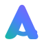

# AnyFlow — Brand

**One flow. Any device.**

---

## The idea

AnyFlow moves what matters between the machines a person already owns, over
their own network, with nothing in the middle. The brand has one job: to make
that feel calm and obviously trustworthy rather than clever.

Two consequences run through everything below.

**Flow is the metaphor, not decoration.** A continuous line joining two points
is the product in one shape: two endpoints, one movement, no third party. It
appears as the mark, as the empty-state illustration, as the transfer motif —
always the same curve, never a generic swoosh.

**The interface stays quiet.** The palette is vivid but the UI is mostly
neutral: white or Ink surfaces, hairline borders, one accent at a time. Colour
is spent on meaning — connected, transferring, revoked — and a screen that is
already saturated has nothing left to say those things with.

---

## Logo

There are two marks. They are not alternatives, and they are not competing
logos: they have different jobs and share one geometry.

### Flowing A — the institutional mark



An abstract "A" built from flowing lines, with the crossbar running through
and out to the right like a ribbon. This is AnyFlow *the project*: the
wordmark lockup, About screens, documentation, a future site.

Files: [`logo-flowing-a.svg`](assets/logo-flowing-a.svg),
[`logo-flowing-a-mono.svg`](assets/logo-flowing-a-mono.svg),
[`logo-lockup.svg`](assets/logo-lockup.svg).

### Flowing Ribbon — the product and connection mark


One continuous stroke from a teal node to a violet node:

```text
device ●~~~~~~~~~● device
```

This is AnyFlow *the running thing*: the app icon, the app bar, the tray, the
transfer motif, the empty state. It is the mark people see most.

Files: [`icon-flowing-ribbon.svg`](assets/icon-flowing-ribbon.svg),
[`icon-flowing-ribbon-mono.svg`](assets/icon-flowing-ribbon-mono.svg),
[`app-icon.svg`](assets/app-icon.svg),
[`ribbon-connection.svg`](assets/ribbon-connection.svg) (the wide form, for
empty states).

### What makes them a family

Both are drawn on a 64-unit grid with a **6.5-unit stroke**, **round
terminals**, the same easing in the curves, and the same gradient running
lower-left to upper-right. The ribbon's node circles and the A's bar terminal
are the same radius. Redraw either one at a different weight and they stop
being a family.

### Misuse

Do not:

- rotate, shear, or flip either mark;
- recolour them outside the brand gradient or a single flat brand colour;
- put the Flowing A on an app icon, or the Ribbon in a wordmark lockup;
- add a shadow, outline, or bevel;
- place either mark on a busy photograph;
- reproduce the gradient version below about 20 px — use the monochrome file;
- redraw the curve "close enough". The path data is the mark.

---

## Palette — Palette A

| Token | Hex | What it is for |
|---|---|---|
| **Primary Teal** | `#16B8A6` | Connected, active, flow origin, toggles |
| **Primary Blue** | `#4F7CFF` | Primary actions, links, progress, selection |
| **Violet** | `#8B5CF6` | Secondary accent, gradients, flow destination |
| **Ink** | `#0F172A` | Primary text, dark surfaces, dark-theme base |
| **Paper** | `#F8FAFC` | Application background, light surfaces |

### The two-family rule

This is the single most important thing on this page.

**The brand hues above are not legible as text.** Brand teal on white is
**2.49 : 1** — WCAG AA asks for 4.5 : 1. Blue reaches 3.71 : 1 and violet
4.23 : 1, both short of it. The design reference draws "Connected" in brand
teal; done literally, that makes the most important word on the screen the
hardest one to read.

So the palette has two families:

| Family | Use | Rule |
|---|---|---|
| `brand.*` | Fills, marks, gradients, indicator dots — shapes large enough that their colour is decoration | Never for text or small icons |
| `on_light.*` / `on_dark.*` | Every text label, every icon at label size | Corrected until it clears AA on its own surface |

| Role | Light (on white) | Dark (on Ink) |
|---|---|---|
| Teal | `#0F766E` — 5.47 : 1 | `#2DD4BF` — 9.59 : 1 |
| Blue | `#3B5BDB` — 5.67 : 1 | `#8FA9FF` — 7.90 : 1 |
| Violet | `#7C3AED` — 5.70 : 1 | `#A78BFA` — 6.56 : 1 |
| Amber | `#B45309` — 5.02 : 1 | `#FBBF24` — 10.69 : 1 |
| Red | `#DC2626` — 4.83 : 1 | `#F87171` — 6.45 : 1 |

These ratios are **asserted by tests**, not just written here — see
[Tokens](#tokens) below.

### Neutrals

Paper and Ink are the two ends of one slate ramp, so the whole scale is
already implied by the brand:

`#F8FAFC` · `#F1F5F9` · `#E2E8F0` · `#CBD5E1` · `#94A3B8` · `#64748B` ·
`#475569` · `#334155` · `#1E293B` · `#0F172A` · `#020617`

Semantic names — `surface`, `border`, `text-secondary`, `disabled` and the
rest — are defined in [`tokens.json`](tokens.json). Screens use those, never a
ramp step directly and never a literal hex.

---

## Gradient

The official sweep is Teal → Blue → Violet.

There are **two** of them, and choosing wrongly is an accessibility bug rather
than a matter of taste:

| Gradient | Stops | Use |
|---|---|---|
| **Brand** (decorative) | `#16B8A6` → `#4F7CFF` → `#8B5CF6` | Marks, ribbons, progress fills. **Never** under text. |
| **CTA** (text-bearing) | `#0B7F72` → `#3B5BDB` → `#7C3AED` | Primary buttons. White clears 4.5 : 1 at *every* interpolated point, not just at the stops. |

Use gradient sparingly: the mark, one primary button, a progress fill, an
illustration. The interface stays neutral.

---

## Typography

**Inter** is the direction. It is deliberately **not bundled** on either
platform, and the reason differs:

- **Android** — four Inter weights add roughly a megabyte to an APK whose size
  is a feature, to replace a system face that is already a neo-grotesque with
  near-identical metrics. The scale is applied to the platform UI face.
- **Desktop** — on GNOME, overriding the user's own font setting is the wrong
  trade. The stack is `Inter, Cantarell, Adwaita Sans, sans-serif`, so Inter
  is used when it is installed and the native face otherwise.

What the design system actually owns — the sizes, weights, line heights and
tracking — is applied either way, and swapping in Inter later touches one
constant per platform.

| Role | Size | Weight | Line height |
|---|---|---|---|
| Display | 32 | 700 | 40 |
| Title | 24 | 700 | 32 |
| Heading | 20 | 600 | 28 |
| Subtitle | 16 | 600 | 24 |
| Body | 14 | 400 | 20 |
| Label | 13 | 500 | 18 |
| Caption | 12 | 400 | 16 |
| Mono | 13 | 400 | 20 |

**Monospace is not decorative.** Fingerprints, device ids and hashes are set
in `JetBrains Mono, Source Code Pro, monospace` because a fingerprint is
compared character by character against another screen, and a proportional
face makes `1`/`l` and `0`/`O` a coin toss.

---

## Spacing, radius, elevation

- **Spacing** — 4 px base: 4, 8, 12, 16, 20, 24, 32, 40, 48, 64.
- **Radius** — small 8, medium 12, large 16, xlarge 20, full 999. Cards are
  moderately rounded; buttons are pills. Nothing is bubble-round.
- **Elevation** — deliberately low. Depth comes from a 1 px border and a
  whisper of shadow. A card at 1 dp reads as a sheet of paper; the same card
  at 6 dp reads as a floating dialog and competes with things that genuinely
  are floating.

---

## Iconography

One family per platform, and that is the point rather than a compromise:

- **Android** — the AnyFlow set in
  [`assets/icons/`](assets/icons/), mirrored as vector drawables in
  `android/app/src/main/res/drawable/`. 24 dp grid, 2 px stroke, round caps
  and joins. The drawables are generated from the SVGs, so the two cannot
  drift.
- **Desktop** — the platform's own **Adwaita symbolic** set. GTK recolours a
  symbolic icon by forcing a fill, which turns a stroke-drawn glyph into a
  solid blob; accent tinting is load-bearing in this design (status colours,
  tinted tiles), so tintable native icons win over a bespoke set that cannot
  be tinted.

A GNOME app that used Material glyphs would look like a port. This is what
"native iconography appropriate to the platform" means in practice.

---

## Light and dark

Light is the primary theme: Paper background, white surfaces, Ink text.

Dark is **derived from Ink, not inverted**. The background (`#0A0F1C`) sits
just *below* Ink and Ink itself becomes the card surface, so a card reads as
lifted out of the page exactly as it does in light. Inverting the light ramp
would have put the lightest neutral behind the darkest text and lost that
relationship entirely.

Gradients stay vivid in dark; accents move to the `on_dark` family.

---

## Tokens

[`tokens.json`](tokens.json) is the single source of truth. **Both platforms
read it in their tests:**

- `desktop/gui/src/theme.rs` — `mod tests`
- `android/app/src/test/.../DesignTokensTest.kt`

Change a value in one place and the other side fails. Those tests also
recompute every contrast ratio quoted above — including sampling the CTA
gradient's interpolation — so the accessibility claims are executable rather
than asserted.

Platform token modules:

| | |
|---|---|
| Android | `ui/theme/{Color,Type,Dimens,Motion,Gradients,Status}.kt` |
| Desktop | `desktop/gui/src/theme.rs` + `desktop/gui/data/style.css` |

No screen contains a literal hex value.

---

## Assets

| File | Role |
|---|---|
| [`logo-flowing-a.svg`](assets/logo-flowing-a.svg) | Institutional mark, full colour |
| [`logo-flowing-a-mono.svg`](assets/logo-flowing-a-mono.svg) | Institutional mark, single colour |
| [`icon-flowing-ribbon.svg`](assets/icon-flowing-ribbon.svg) | Product mark, full colour |
| [`icon-flowing-ribbon-mono.svg`](assets/icon-flowing-ribbon-mono.svg) | Product mark, single colour |
| [`app-icon.svg`](assets/app-icon.svg) | 512 px app icon on Ink |
| [`ribbon-connection.svg`](assets/ribbon-connection.svg) | Wide connection ribbon, empty states |
| [`wordmark.svg`](assets/wordmark.svg) / [`-mono`](assets/wordmark-mono.svg) | Wordmark |
| [`logo-lockup.svg`](assets/logo-lockup.svg) | Mark + wordmark + tagline |
| [`assets/icons/`](assets/icons/) | The 28-glyph AnyFlow icon family |

Android adaptive icon: `res/mipmap-anydpi-v26/ic_launcher.xml` with an Ink
background, the ribbon foreground inside the 72 dp safe zone, and a
monochrome layer for Android 13+ themed icons.

All artwork here is original vector work. No third-party or
unknown-licence asset is included, and the wordmark is set in live text rather
than outlines so the logo never disagrees with the face the product renders.
