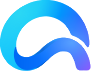

# OmniBridge — Brand

**One bridge. Any device.**

---

## Canonical identity

| Field | Value |
|---|---|
| **Product name** | **OmniBridge** — one word, capital O, capital B. Never "Omnibridge", "Omni Bridge" or "OB". |
| **Tagline** | **One bridge. Any device.** |
| **Positioning** | A single bridge between devices and platforms. |
| **Identity direction** | **Platform-neutral.** Not an Android product, not a Linux product: Android and Linux are its first two implementations. Nothing in the name, the mark or the copy may imply otherwise. |
| **Translated?** | The name is **not** translated. The tagline is not currently localised (the app ships one locale); if it is localised later, it is translated as one whole sentence pair, never assembled from parts. |
| **Previous name** | AnyFlow (*One flow. Any device.*), renamed before the public v1.0.0 release — see [ADR-0018](../adr/ADR-0018-rename-to-omnibridge.md) and [the migration note](../MIGRATION-ANYFLOW-TO-OMNIBRIDGE.md). |

### Reserved naming family

Reserved for future use, and **not implemented today**. Nothing in the product
currently uses any of these, and no surface should adopt one without a
decision record:

| Name | Reserved for |
|---|---|
| **OmniBridge Desktop** | the desktop application, when it needs naming apart from the product |
| **OmniBridge for Android** | the Android application, likewise |
| **OmniBridge Connect** | — |
| **OmniBridge Mirror** | — |
| **OmniBridge Find** | — |

The current application is called **OmniBridge**, everywhere, with no suffix.

---

## Visual identity: CLOSED

The official OmniBridge artwork was supplied and installed on 2026-09-21. The
`BLOCKED_VISUAL_ASSET` notice that stood here is withdrawn: there is no
placeholder left anywhere in the product, and no AnyFlow-era mark is drawn by
any active surface.

| | |
|---|---|
| **Canonical mark** | [`assets/omnibridge-mark.svg`](assets/omnibridge-mark.svg) |
| **Name** | OmniBridge |
| **Tagline** | One bridge. Any device. |
| **Typeface** | Inter |
| **Palette** | `#4F6BFF` Primary Blue · `#18B8C9` Bridge Cyan · `#7C5CFC` Accent Violet · `#0B1020` Dark · `#F7F9FC` Surface |

`omnibridge-mark.svg` is the single source of truth for geometry. Every other
asset and every platform derivative is built from *its* outline, and that is
asserted rather than asked for: `desktop/gui/tests/brand_assets.rs` and
Android's `BrandingResourcesTest` both re-read this file and compare the
outline byte for byte, so a derivative that is redrawn, retraced or edited
fails the build instead of shipping.

The artwork is installed exactly as supplied. This repository does not
regenerate, simplify or re-export it.

The palette below **is** the official one, in the artwork and in the code
alike. The UI gradient tokens carried the AnyFlow-era sweep
(`#16B8A6` → `#4F7CFF` → `#8B5CF6`) until the UI polish sprint retuned
`docs/design/tokens.json`, `ui/theme/Color.kt` and `desktop/gui/src/theme.rs`
onto it. There is no remaining delta between the brand and the interface.

---

## The idea

OmniBridge moves what matters between the machines a person already owns, over
their own network, with nothing in the middle. The brand has one job: to make
that feel calm and obviously trustworthy rather than clever.

Two consequences run through everything below.

**The bridge is the metaphor, not decoration.** One span joining two sides is
the product in one shape: two endpoints, one crossing, no third party. It
appears as the mark, as the empty-state illustration, as the transfer motif —
always the same artwork, never a generic swoosh.

**The interface stays quiet.** The palette is vivid but the UI is mostly
neutral: white or Ink surfaces, hairline borders, one accent at a time. Colour
is spent on meaning — connected, transferring, revoked — and a screen that is
already saturated has nothing left to say those things with.

---

## Logo

There is **one** mark. Not a pair with different jobs, not an institutional cut
and a product cut — one piece of artwork, used everywhere, at every size.

A curled span: the ribbon sweeps over and folds back through itself, so the
two sides it joins are drawn by one unbroken gesture. On a 188 × 146 grid, in
the cyan → blue → violet sweep.

| Cut | File | Where it is used |
|---|---|---|
| Full colour | [`omnibridge-mark.svg`](assets/omnibridge-mark.svg) | **Canonical.** App bar, empty states, GTK `brand_mark`, Android `logo_omnibridge_mark` |
| Single colour | [`omnibridge-mark-mono.svg`](assets/omnibridge-mark-mono.svg) | Anywhere the mark must inherit the text colour |
| Application icon | [`omnibridge-app-icon.svg`](assets/omnibridge-app-icon.svg) | Linux hicolor icon, Android adaptive foreground |
| Themed icon | [`omnibridge-android-monochrome.svg`](assets/omnibridge-android-monochrome.svg) | Android 13+ themed launcher layer |
| Wordmark | [`omnibridge-wordmark.svg`](assets/omnibridge-wordmark.svg) | Wordmark alone |
| Lockup | [`omnibridge-logo-lockup.svg`](assets/omnibridge-logo-lockup.svg) | Mark + wordmark + tagline |

### There is no small cut, and that is deliberate

The AnyFlow marks needed a heavier variant below about 24 px because they were
*stroked*: an 8-unit stroke on a 64-unit grid falls under a pixel and a half at
that size and greys out. The OmniBridge mark is **filled**. It scales down as
area rather than as line weight, so one file answers for every size and there
is no second cut to keep in step.

### Misuse

Do not:

- rotate, shear, or flip the mark;
- recolour it outside the supplied gradients or a single flat brand colour;
- separate the mark from its lockup and re-set the wordmark by hand;
- add a shadow, outline, or bevel;
- place the mark on a busy photograph;
- redraw, retrace or "clean up" the curve. The path data **is** the mark, and
  both front ends fail their build if it changes.

---

## Palette

| Token | Hex | What it is for |
|---|---|---|
| **Bridge Cyan** | `#18B8C9` | Connected, active, flow origin, toggles |
| **Primary Blue** | `#4F6BFF` | Primary actions, links, progress, selection |
| **Accent Violet** | `#7C5CFC` | Secondary accent, gradients, flow destination |
| **Dark** | `#0B1020` | Primary text, dark surfaces, dark-theme card |
| **Surface** | `#F7F9FC` | Application background, light surfaces |

The token names are these names. `Brand.Teal`, `brand::INK` and `brand::PAPER`
are gone: a constant called `Teal` holding a cyan is a comment that lies, and
it is the kind that survives a rebrand.

### The two-family rule

This is the single most important thing on this page.

**The brand hues above are not legible as text.** Bridge Cyan on white is
**2.40 : 1** — WCAG AA asks for 4.5 : 1. Blue reaches 4.30 : 1 and violet
4.38 : 1, both short of it. The design reference draws "Connected" in brand
cyan; done literally, that makes the most important word on the screen the
hardest one to read.

The retune moved all three hues and did **not** move them closer to legible:
blue and violet now land just under the line rather than well under it, which
is precisely why the correction is a table and not a judgement call.

So the palette has two families:

| Family | Use | Rule |
|---|---|---|
| `brand.*` | Fills, marks, gradients, indicator dots — shapes large enough that their colour is decoration | Never for text or small icons |
| `on_light.*` / `on_dark.*` | Every text label, every icon at label size | Corrected until it clears AA on its own surface |

| Role | Light (on white) | Dark (on Dark) |
|---|---|---|
| Cyan | `#10747E` — 5.50 : 1 | `#3DC9D7` — 9.50 : 1 |
| Blue | `#445CDD` — 5.50 : 1 | `#90A1FF` — 7.87 : 1 |
| Violet | `#6A49EE` — 5.53 : 1 | `#A28CFA` — 6.91 : 1 |
| Amber | `#B45309` — 5.02 : 1 | `#FBBF24` — 11.34 : 1 |
| Red | `#DC2626` — 4.83 : 1 | `#F87171` — 6.84 : 1 |

Amber and red did not move. **Brand colours and semantic colours are
different concepts**: warning and error mean the same thing whatever the
identity is, and recolouring them to match a sweep would have made the
palette prettier and the status language less legible.

Each hue is the *lightest* shade of its own brand hue that still clears the
floor with the headroom the previous palette had, so they stay recognisably
the brand rather than becoming three dark neutrals.

These ratios are **asserted by tests**, not just written here — see
[Tokens](#tokens) below.

### Neutrals

Surface and Dark are the two ends of one ramp, so the whole scale is already
implied by the brand:

`#F7F9FC` · `#F1F4F9` · `#E2E7F0` · `#CBD3E1` · `#94A0B8` · `#64718B` ·
`#475269` · `#333E55` · `#1E263B` · `#0B1020` · `#05070F`

The ends are the brand exactly — the token tests assert `neutral.50 == Surface`
and `neutral.900 == Dark` rather than trusting this sentence.

**The middle stays neutral.** Interpolating the ramp towards Dark's own
saturation looks more principled and is wrong: Dark is 49 % saturated because
it is nearly black, and carrying that through the midtones turns every body
paragraph and every hairline border faintly blue. Greys are grey.

Semantic names — `surface`, `border`, `text-secondary`, `disabled` and the
rest — are defined in [`tokens.json`](tokens.json). Screens use those, never a
ramp step directly and never a literal hex.

---

## Gradient

The official sweep is Cyan → Blue → Violet.

There are **two** of them, and choosing wrongly is an accessibility bug rather
than a matter of taste:

| Gradient | Stops | Use |
|---|---|---|
| **Brand** (decorative) | `#18B8C9` → `#4F6BFF` → `#7C5CFC` | Marks, ribbons, progress fills. **Never** under text. |
| **CTA** (text-bearing) | `#10747E` → `#445CDD` → `#6A49EE` | Primary buttons. White clears 4.5 : 1 at *every* interpolated point — 5.48 : 1 at the worst — not just at the stops. |

The CTA sweep **is** the corrected accent triple, not a fourth colour set
tuned by hand. That is the whole trick: the three hues a label may be drawn
in are already the three a label may sit on, so there is nothing extra to
keep in step the next time the palette moves.

Use gradient sparingly: the mark, one primary button, a progress fill, an
illustration. The interface stays neutral.

---

## Typography

**Inter** is the direction. It is deliberately **not bundled** on either
platform, and the reason differs:

- **Android** — four Inter weights add roughly a megabyte to an APK whose size
  is a feature, to replace a system face that is already a neo-grotesque with
  near-identical metrics. The scale is applied to the platform UI face.
- **Desktop** — on GNOME, overriding the user's own font setting is the wrong
  trade. The stack is `Inter, Cantarell, Adwaita Sans, sans-serif`, so Inter
  is used when it is installed and the native face otherwise.

What the design system actually owns — the sizes, weights, line heights and
tracking — is applied either way, and swapping in Inter later touches one
constant per platform.

| Role | Size | Weight | Line height |
|---|---|---|---|
| Display | 32 | 700 | 40 |
| Title | 24 | 700 | 32 |
| Heading | 20 | 600 | 28 |
| Subtitle | 16 | 600 | 24 |
| Body | 14 | 400 | 20 |
| Label | 13 | 500 | 18 |
| Caption | 12 | 400 | 16 |
| Mono | 13 | 400 | 20 |

**Monospace is not decorative.** Fingerprints, device ids and hashes are set
in `JetBrains Mono, Source Code Pro, monospace` because a fingerprint is
compared character by character against another screen, and a proportional
face makes `1`/`l` and `0`/`O` a coin toss.

---

## Spacing, radius, elevation

- **Spacing** — 4 px base: 4, 8, 12, 16, 20, 24, 32, 40, 48, 64.
- **Radius** — small 8, medium 12, large 16, xlarge 20, full 999. Cards are
  moderately rounded; buttons are pills. Nothing is bubble-round.
- **Elevation** — deliberately low. Depth comes from a 1 px border and a
  whisper of shadow. A card at 1 dp reads as a sheet of paper; the same card
  at 6 dp reads as a floating dialog and competes with things that genuinely
  are floating.

---

## Iconography

One family per platform, and that is the point rather than a compromise:

- **Android** — the OmniBridge set in
  [`assets/icons/`](assets/icons/), mirrored as vector drawables in
  `android/app/src/main/res/drawable/`. 24 dp grid, 2 px stroke, round caps
  and joins. The drawables are generated from the SVGs, so the two cannot
  drift.
- **Desktop** — the platform's own **Adwaita symbolic** set. GTK recolours a
  symbolic icon by forcing a fill, which turns a stroke-drawn glyph into a
  solid blob; accent tinting is load-bearing in this design (status colours,
  tinted tiles), so tintable native icons win over a bespoke set that cannot
  be tinted.

A GNOME app that used Material glyphs would look like a port. This is what
"native iconography appropriate to the platform" means in practice.

---

## Light and dark

Light is the primary theme: Surface background, white cards, Dark text.

Dark is **derived from Dark, not inverted**. The background (`#080C18`) sits
just *below* Dark and Dark itself becomes the card surface, so a card reads as
lifted out of the page exactly as it does in light. Inverting the light ramp
would have put the lightest neutral behind the darkest text and lost that
relationship entirely.

| | Dark theme |
|---|---|
| Background | `#080C18` |
| Surface (card) | `#0B1020` — the brand Dark |
| Elevated | `#141B30` |
| Sunken | `#05070F` |

The ordering `sunken < background < surface < elevated` is what makes a card
read as lifted, so it is asserted by a test on both platforms rather than
left to whoever next nudges one of the four.

Gradients stay vivid in dark; accents move to the `on_dark` family.

---

## Tokens

[`tokens.json`](tokens.json) is the single source of truth. **Both platforms
read it in their tests:**

- `desktop/gui/src/theme.rs` — `mod tests`
- `android/app/src/test/.../DesignTokensTest.kt`

Change a value in one place and the other side fails. Those tests also
recompute every contrast ratio quoted above — including sampling the CTA
gradient's interpolation — so the accessibility claims are executable rather
than asserted.

Platform token modules:

| | |
|---|---|
| Android | `ui/theme/{Color,Type,Dimens,Motion,Gradients,Status}.kt` |
| Desktop | `desktop/gui/src/theme.rs` + `desktop/gui/data/style.css` |

No screen contains a literal hex value.

---

## Assets

| File | Role |
|---|---|
| [`omnibridge-mark.svg`](assets/omnibridge-mark.svg) | **Canonical mark.** Every other asset derives from this outline |
| [`omnibridge-mark-mono.svg`](assets/omnibridge-mark-mono.svg) | Mark, single colour, inherits `currentColor` |
| [`omnibridge-app-icon.svg`](assets/omnibridge-app-icon.svg) | 512 px application icon |
| [`omnibridge-android-monochrome.svg`](assets/omnibridge-android-monochrome.svg) | Android themed-icon cut |
| [`omnibridge-wordmark.svg`](assets/omnibridge-wordmark.svg) | Wordmark |
| [`omnibridge-logo-lockup.svg`](assets/omnibridge-logo-lockup.svg) | Mark + wordmark + tagline |
| [`assets/icons/`](assets/icons/) | The 28-glyph OmniBridge icon family — brand-neutral UI glyphs, carried over unchanged |

Android adaptive icon: `res/mipmap-anydpi-v26/ic_launcher.xml` with a Dark
(`#0B1020`) background, the mark as the adaptive foreground inside the 72 dp
safe zone, and a monochrome layer for Android 13+ themed icons. All three are
generated from `omnibridge-mark.svg` and asserted against it.

The wordmark and the lockup ship as **outlines**, not live text. That is a
property of the supplied artwork and it is the reason the typeface is recorded
here as well: a surface that sets "OmniBridge" as text must set it in Inter to
match the wordmark it sits beside. It also means the letterforms cannot be
checked by reading the file — what the tests assert instead is that no active
asset carries the pre-rename identity, and that every product surface which
*speaks* the name says OmniBridge.
